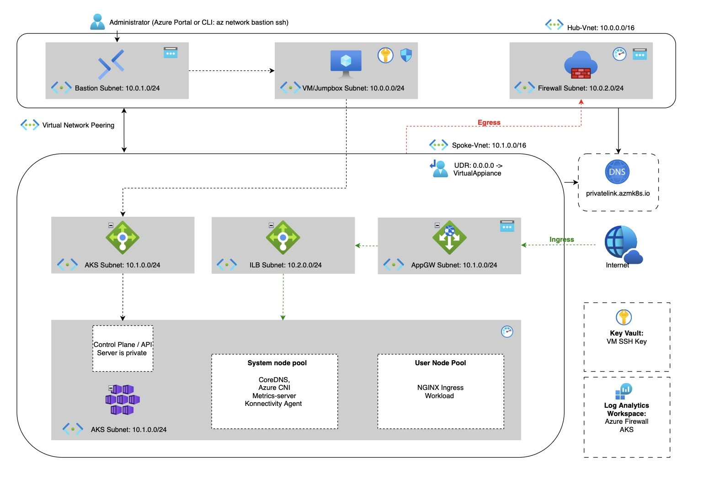

# Private Azure Kubernetes Service (AKS) cluster with Azure Firewall and Application Gateway  

## Overview
This reposity contains Terraform configuration for deploying private Azure Kubernetes Service (AKS) cluster with Azure Firewall and Application Gateway. Architecture follows Hub-Spoke network topology. AKS management is accessible by VM/Jumpbox in the Hub. You can access VM/Jumpbox through Bastion service either Azure Portal or Azure CLI.


## Architecture

This deployment follows Microsoft recommended AKS Baseline Infrastructure achitecture. 




Learn more about AKS Baseline reference architecture:

https://learn.microsoft.com/en-us/azure/architecture/reference-architectures/containers/aks/baseline-aks

## AKS Network profile


**Azure CNI** (Overlay)

Learn more about  AKS CNI networking: 

https://learn.microsoft.com/en-us/azure/aks/concepts-network-cni-overview

Learn more about Cilium, which powers AKS CNI.

https://cilium.io


## Azure Services

### Management

- **Resource Groups** - resource groups for hub, spokes, AKS, and monitoring. 

### Azure Compute

- **Azure Virtual Machines** - (Linux jumpbox)

### Azure Containers

- **Azure Kubernetes Service (AKS)** - Privately managed Kubernetes cluster and node pools.

### Azure Networking

- **Virtual Network (VNet)** - Hub and spoke virtual networks
- **Network Interface (NIC)** - VM network interface for the jumpbox. 
- **Public IP Address** - public IPs for Bastion, Firewall, and Application Gateway.
- **Subnets** - Subnets for AKS, Application Gateway, AzureFirewallSubnet, Bastion, Jumpbox
- **Virtual Network Peering** - Hub-spoke peering.
- **Network Security Group (NSG)** - Security groups applied to subnets.
- **Route Table (UDR)** - User-defined routing that directs spoke outbound to Azure Firewall.
- **Azure Firewall** - Manages outbound connection via firewall.
- **Azure Firewall Policy** - Firewall rules
- **Azure Application Gateway** - Application gateway used to traffic ingress to Internal Load Balancer
- **Azure Bastion** - Bastion host for secure SSH into Jumpbox. 
- **Azure Private Endpoint** - Private endpoint for the AKS control plane.
- **Azure Private DNS Zone** - Private DNS zone for AKS private API (privatelink.*.azmk8s.io). 
- **Azure Private DNS Zone Virtual Network Link** - Links the private DNS zone 
- **Azure DNS Private Resolver** - Private DNS resolver

### Identity

- **Managed Identities** - User-assigned managed identities for AKS. 
- **Role Assignments** - Role assignments 

### Security

- **Azure Key Vault** - Store VM SSH private key.

### Monitoring

- **Log Analytics Workspace (Azure Monitor Logs)** — For firewall and cluster logs.
- **Azure Monitor Diagnostic Settings** - Collects Firewall and AKS logs. 

## Repository Structure
```
├── architecture.jpg
├── cloud-init
│   └── setup-vm.sh
├── Container_AKS.tf
├── Helpers.tf
├── Management_RG.tf
├── Monitor_Diagnostic.tf
├── Monitor_LAW.tf
├── output.tf
├── provider.tf
├── readme.md
├── Security_Identities.tf
├── Security_KV.tf
├── terraform.tfstate
├── terraform.tfstate.backup
├── variables.tf
├── VM_Jumpbox.tf
├── VNet_AFW.tf
├── VNet_AGW.tf
├── VNet_Bastion.tf
├── VNet_DNS.tf
├── VNet_Infra.tf
├── VNet_NSG.tf
├── VNet_PrivateEndpoint.tf
└── VNet_RouteTable.tf
```

### How to deploy

By default this configuration uses **West Europe** as region. You can change this on **variables.tf**

Ensure you are logged in to your Azure subscription.

```
az login
```

Export you Subscription ID
```
export $ARM_SUBSCRIPTION_ID=<YOUR SUBSCRIPTION ID>
```

Follow Terraform workflow

Initialize Terraform
```
terraform init
```

Validate Configuration
```
terraform validate
```

Run planning and save plan
```
terraform plan -out=tfplan
```

Run apply and deployment starts
```
terraform apply tfplan
```

**Notice that this deployment might take some time which depends on Azure API server busyness. Deployment time can variate from 15-30 minutes**

### How to access VM Jumpbox

You can access VM Jumpbox from Azure Portal or create Azure Bastion Tunneling. SSH key is generated automatically.

Azure portal: https://portal.azure.com

Select Bastion service and from authentication use username: **azureuser** and select secret from the Keyvault 

In case of Bastion Tunnel. We need to extract the private SSH key
```
terraform output -raw vm-jumpbox-private-key > ~/.ssh/vm-jumpbox
```

Make SSH key accessible
```
chmod 600 ~/.ssh/vm-jumpbox
```

Create Bastion Tunnel.
```
az network bastion tunnel \
  --name bas-sbx-we-hub \
  --resource-group rg-demo-sbx-we-hub \
  --target-resource-id $(az vm show \
      -g rg-demo-sbx-we-hub \
      -n demo_sbx_jump_vm \
      --query id -o tsv) \
  --resource-port 22 \
  --port 50023
```
Login to Jumpbox VM
```
ssh -i ~/.ssh/vm-jumpbox -p 50023 azureuser@127.0.0.1
```

### How to access AKS API server

This deployment automatically downloads and installs following services to Jumpbox:

- Azure CLI
* Kubectl
+ Helm

Login to Azure with created User Assigned Identity **in Jumpbox**

```
az login --identity
```

Retrieve configuration for Kubectl
```
az aks get-credentials --resource-group rg-demo-sbx-we-aks --name aks-sbx-we-aks01 --overwrite-existing
```

Now you should be able to use kubectl normally. For example:
```
kubectl get all
```

Which should return following:

```
NAME                 TYPE        CLUSTER-IP   EXTERNAL-IP   PORT(S)   AGE
service/kubernetes   ClusterIP   12.34.56.7   <none>        443/TCP   54m57s
```


You're private AKS cluster should now be running for deployments!

### Nginx Ingress Controller

This deployment uses Nginx Ingess Controller. There are some consideration to be noted since we are using Application Gateway.

When you make your deployment, you must specify **Load Balancer annotations** in **Ingress** object

By default Internal Load Balancer is in **"snet-lb-sbx-we-spoke-aks"** subnet.

By default Application Gateway uses private ip **10.1.2.10** in backend pool.


Here is example of annotations to be specified

```
loadBalancerAnnotations:
    service.beta.kubernetes.io/azure-load-balancer-internal: "true"
    service.beta.kubernetes.io/azure-load-balancer-internal-subnet: "snet-lb-sbx-we-spoke-aks" # ILB subnet
    service.beta.kubernetes.io/azure-load-balancer-ipv4: "10.1.2.10" #ILB IP
```

## Issues

Feel free to make issue if you feel that there is a bug. Take in consideration that Azure services update constantly and in this project used Terraform providers version may be depracated in the future.